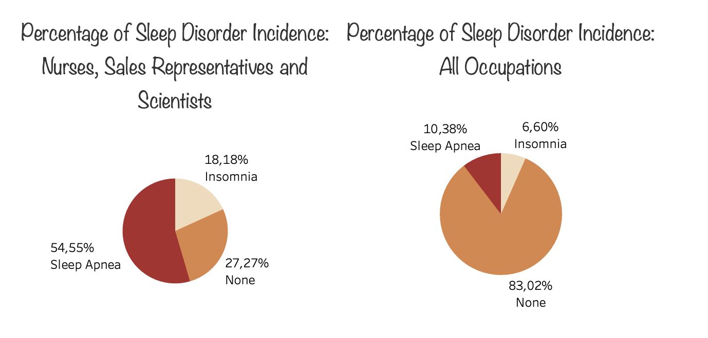

# Data Visualization Project | Tableau: [Exploring Sleep Quality: A Comparative Analysis of Occupation, Age, and Gender](https://public.tableau.com/app/profile/david.nunez2187/viz/quality_sleep_David_2/Story1?publish=yes)

## 1. Project Description.

This project aims to conduct a comprehensive analysis and derive valuable insights from the data related to sleep quality. The project encompasses extracting and transforming data to facilitate the exploration of the relationship between sleep quality and various variables, including occupations, genders, and other relevant factors. By thoroughly examining these relationships, the project seeks to gain a deeper understanding of the factors influencing sleep quality and provide valuable insights for further research and potential interventions.

## 2. Data Extraction

The data for this project has been obtained from [Kaggle:](https://www.kaggle.com/datasets/uom190346a/sleep-health-and-lifestyle-dataset) as a CSV document. Kaggle is a widely recognized platform for accessing and sharing datasets from various domains. The dataset chosen for this project specifically focuses on sleep health and lifestyle. The CSV format allows for easy manipulation and analysis of the data using tools like Pandas and NumPy.

## 3. Data Cleaning and Transformation

The dataset used in this project required minimal cleaning and transformation as it was already in a relatively suitable format for analysis and visualization. A few minor adjustments were made to ensure the dataset's readiness for Tableau and subsequent data exploration. These adjustments primarily focused on handling any missing values and standardizing variable names or formats, ensuring consistency throughout the dataset. Overall, the cleaning process was relatively straightforward due to the dataset's initial quality, allowing for efficient data analysis and visualization in Tableau.

## 4. Data Analysis

The data was initially analyzed using the pandas library in Python, which included calculating correlations between variables.

Tableau was used to generate scatter plots, bar charts, and more. These analytical methods were employed to gain insights and examine relationships within the dataset.

Based on the analysis, several conclusions can be drawn. However, it's important to note that the sample size is relatively small, so the conclusions may be incomplete or not completely reliable:

- It appears that the majority of people sleep properly. Around 70% of the participants in the study belong to the higher index range of 7, 8, or 9 out of 10, which indicates good sleep quality.

- There appears to be a correlation between improved sleep quality and age. However, there doesn't seem to be any significant differences in sleep quality between genders.

- In terms of occupations, Sales Representatives, Scientists, and Nurses have the lowest sleep quality, while Engineers, Accountants, and Teachers have the highest sleep quality.

- The incidence of insomnia and sleep apnea is higher among Sales Representatives, Scientists, and Nurses compared to the overall group, with rates of 18% and 54% respectively, compared to 6% and 10% for all groups. Again, it's important to consider the small sample size when interpreting these conclusions.

- Focusing specifically on Sales Representatives, Scientists, and Nurses, they show higher levels of stress, high blood pressure, and heart rate compared to the overall sample. Additionally, they seem to sleep around 50 minutes less than the overall sample.

You can access the Tableau website and view all the interactive visualization by clicking [here](https://public.tableau.com/app/profile/david.nunez2187/viz/quality_sleep_David_2/Story1?publish=yes)

## 5. Documents in this repository:

This repository consists of the following documents and folders:

### Data folder
It contains two subfolders:
- Cleaned: This subfolder contains the cleaned CSV file, which was exported from Python after the cleaning process.
- Raw: This subfolder contains the raw CSV document, that was initially obtained.

### Jupyter notebook folder
This folder contains a Jupyter notebook that provides detailed information about the data cleaning, transformation, and analysis process. The notebook covers each step thoroughly, offering insights into the methodology and findings of the project.

### Images folder
This folder contains .png files of the graphs generated in Tableau. These visualizations provide insights and visual representations of the relationships and patterns identified during the analysis.

### Readme
The README file provides a comprehensive overview of the project, including the project description, data cleaning, analysis, visualization and conclusions. It serves as a guide for users to understand the project's purpose and the steps involved.

You can find the link to access Tableau throughout this README. Just in case [here is the link again](https://public.tableau.com/app/profile/david.nunez2187/viz/quality_sleep_David_2/Story1?publish=yes)

[LinkedIn profile of the author](https://www.linkedin.com/in/david-n%C3%BA%C3%B1ez-pastrana-595ba684/)

